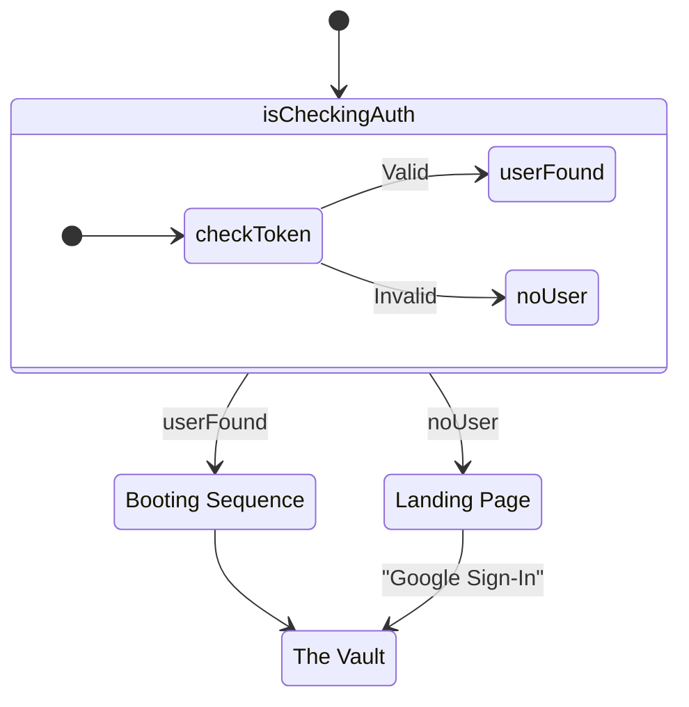

# Auth & State Routing

The core initialization and routing of 2ndBrain relies on a minimal three-state machine managed in `App.jsx`, powered by Firebase Authentication's persistent session state.

## State Management (`appState`)



The application avoids complex routing libraries (like `react-router-dom`) in favor of a strictly controlled, linear state progression:

```javascript
const [appState, setAppState] = useState('marketing');
const [isCheckingAuth, setIsCheckingAuth] = useState(true);
```

The three available states are:
1. `'marketing'`: Renders `<LandingPage />`.
2. `'booting'`: Renders `<BootSequence />`.
3. `'vault'`: Renders `<Vault />`.

## Firebase Authentication Hook

Inside `App.jsx`, a `useEffect` hook triggers immediately on mount to establish a connection with Firebase's auth state.

```javascript
useEffect(() => {
  const unsubscribe = onAuthStateChanged(auth, (currentUser) => {
    setUser(currentUser);
    
    if (currentUser) {
      // Session restored: bypass landing page, go straight to boot sequence
      setAppState('booting'); 
    } else {
      // No session: enforce landing page
      setAppState('marketing');
    }

    setIsCheckingAuth(false);
  });
  
  return () => unsubscribe();
}, []);
```

### The Seamless Auth Check
Because Firebase takes a fraction of a second to confirm local IndexedDB session tokens, `isCheckingAuth` defaults to `true`. During this brief window, the app renders a pure black screen:

```javascript
if (isCheckingAuth) return <div style={{ height: '100vh', backgroundColor: '#020203' }}></div>;
```
This prevents a jarring flash of the Landing Page before instantly redirecting a logged-in user to the Vault.

## The Vault Lock Screen

Interestingly, passing the Google Auth check in `App.jsx` does **not** handle the actual Google Sign-In popup. If a user clicks "Initialize" on the landing page, they are transitioned to the Vault component, but `user` remains `null`.

Inside `Vault.jsx`, this null user triggers the **Lock Screen**:

```javascript
// Inside Vault.jsx
if (!user) {
  return (
    <div className="lock-screen-container">
      <h1>SYSTEM LOCKED</h1>
      <button onClick={handleGoogleSignIn}>Decrypt via Google</button>
    </div>
  );
}
```

When `handleGoogleSignIn` executes `signInWithPopup(auth, provider)`, Firebase updates its internal state. The `onAuthStateChanged` listener back in `App.jsx` catches this update, re-renders the tree, and the Vault seamlessly unlocks, revealing the workspace.
