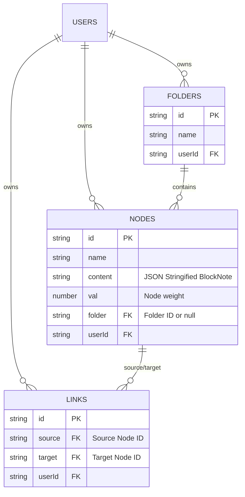

# Database Schema (Firestore)

The 2ndBrain backend is powered by **Firebase Firestore**. The architecture relies on three primary collections. 

Everything is scoped by the user's Google Auth `uid`. When data is fetched using `onSnapshot`, it always filters by `where('userId', '==', user.uid)` to guarantee that no user ever receives another user's data.

## 1. Nodes Collection (`/nodes`)
This collection stores the actual notes/documents.

| Field | Type | Description |
|---|---|---|
| `name` | string | The title of the node (used for linking and NLP matching) |
| `content` | string | A JSON-stringified representation of the BlockNote document |
| `val` | number | The weight/size of the node in the graph (default: 3) |
| `folder` | string \| null | The ID of the folder it belongs to. If null, it's "Unassigned". |
| `createdAt` | number | `Date.now()` timestamp |
| `userId` | string | The Firebase Auth UID of the owner |

## 2. Links Collection (`/links`)
This collection defines the edges in the knowledge graph.

| Field | Type | Description |
|---|---|---|
| `source` | string | The ID of the source node |
| `target` | string | The ID of the target node |
| `userId` | string | The Firebase Auth UID of the owner |

## 3. Folders Collection (`/folders`)
Stores the custom directories created by the user in the sidebar.

| Field | Type | Description |
|---|---|---|
| `name` | string | The display name of the directory |
| `createdAt` | number | `Date.now()` timestamp |
| `userId` | string | The Firebase Auth UID of the owner |

## Safe Deletion Logic
When a user deletes a folder, a batch `updateDoc` operation is triggered. It finds every node where `folder == deletedFolderId` and sets `folder: null`. This ensures that deleting a directory **never** deletes the user's actual notes; they just safely fall back to the root "Unassigned" pool.
