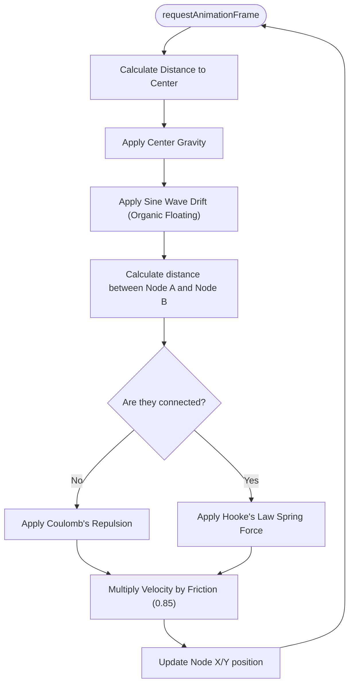

# Canvas Physics Engine

Instead of relying on heavy third-party graph libraries (like D3 or Force-Graph), 2ndBrain implements a custom, highly-optimized 2D physics engine directly on an HTML5 `<canvas>` inside `GraphEngine.jsx`.

## State & Local Orbit Filtering

To prevent the canvas from becoming a tangled, unreadable mess, the graph filters data to show only the "Local Orbit"—the currently selected node and its direct neighbors.

```javascript
const localData = useMemo(() => {
  // Finds links where source or target === selectedNodeId
  // Creates a Set() of those node IDs
  // Returns filtered nodes and links arrays
}, [data, selectedNodeId]);
```

## The Simulation Loop



The engine uses `requestAnimationFrame` to run a continuous 60fps render loop. Every frame, multiple physical forces are calculated and applied to the velocity vectors (`vx`, `vy`) of each node.

### 1. Center Gravity
Pulls all nodes gently toward the center of the canvas to prevent them from flying off-screen.
```javascript
// Applied to every node every frame
n1.vx += (width / 2 - n1.x) * 0.01;
n1.vy += (height / 2 - n1.y) * 0.01;
```

### 2. Organic Floating Force (Sine Wave)
To make the graph feel "alive" even when at rest, a continuous sine wave drift is applied. Upon initialization, each node receives random phase offsets (`floatPhaseX`, `floatPhaseY`) so they drift asynchronously.
```javascript
const time = Date.now() * 0.001;
const FLOAT_AMPLITUDE = 0.03;

n1.vx += Math.sin(time * n1.floatSpeedX + n1.floatPhaseX) * FLOAT_AMPLITUDE;
n1.vy += Math.cos(time * n1.floatSpeedY + n1.floatPhaseY) * FLOAT_AMPLITUDE;
```

### 3. Node Repulsion (Coulomb's Law)
Nodes push each other away using an inverse-square law. The closer they get, the exponentially harder they repel.
```javascript
const REPULSION = 1500;
let dx = n2.x - n1.x;
let dy = n2.y - n1.y;
let distance = Math.sqrt(dx * dx + dy * dy) || 1;

let force = REPULSION / (distance * distance);
// Apply force vectors...
```

### 4. Link Springs (Hooke's Law)
Connected nodes are pulled together by springs that attempt to maintain an ideal resting length (`SPRING_LENGTH = 80`).
```javascript
const SPRING_STIFFNESS = 0.05;
let force = (distance - 80) * SPRING_STIFFNESS;
// Apply force vectors to both nodes...
```

### 5. Friction (Velocity Damping)
Without friction, the kinetic energy in the system would compound infinitely. Velocity is multiplied by a damping factor every frame.
```javascript
node.vx *= 0.85;
node.vy *= 0.85;
```

## Click Detection Engine

Because the nodes are drawn directly onto a bitmap canvas (not DOM elements), standard `onClick` handlers do not work. Instead, the engine listens to clicks on the canvas itself and uses the Pythagorean theorem to calculate if the mouse coordinates intersect with any node's radius.

```javascript
const handleCanvasClick = (event) => {
  const rect = canvas.getBoundingClientRect();
  const clickX = event.clientX - rect.left;
  const clickY = event.clientY - rect.top;

  for (let node of simulationNodes) {
    const dx = clickX - node.x;
    const dy = clickY - node.y;
    const distance = Math.sqrt(dx * dx + dy * dy);
    
    // NODE_RADIUS is 6. We add 4px of tolerance for easier clicking.
    if (distance <= 10) {
      onNodeClick(node.id);
      break; 
    }
  }
};
```
