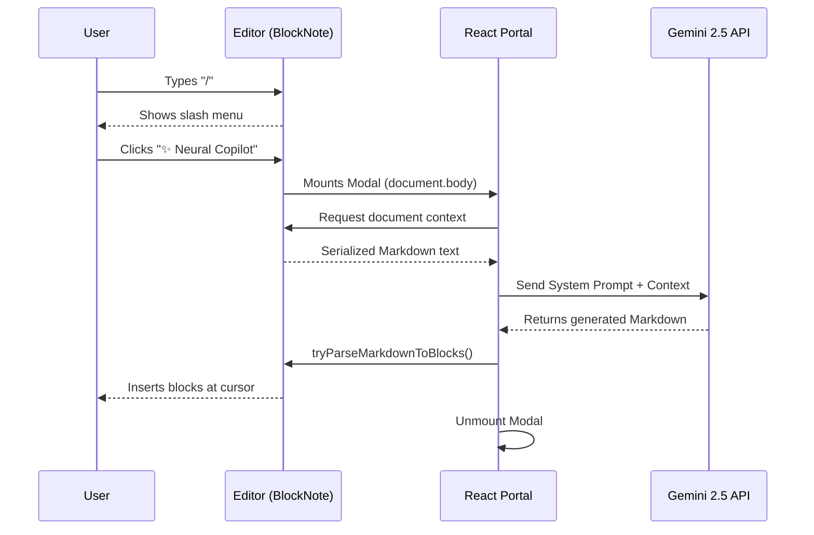

# Neural Copilot (AI)

The v2.0 update introduced an inline AI writing assistant powered by **Gemini 2.5 Flash**. 

## How it works

1. **Trigger**: The user types `/` in the BlockNote editor. A custom slash menu item titled "✨ Neural Copilot" is injected into the default BlockNote menu.
2. **Modal Rendering**: When clicked, a cinematic cyber modal opens. This modal is rendered using a **React Portal** (`createPortal`) targeting `document.body`. This ensures it breaks out of the editor's z-index and overflow constraints and centers perfectly on the screen.
3. **Context Gathering**: The system serializes the entire current document into text and passes it to the AI as context.
4. **Generation**: The Gemini API processes the prompt along with a custom Zettelkasten-focused system instruction.
5. **Insertion**: The AI returns Markdown. We use `editor.tryParseMarkdownToBlocks()` to seamlessly convert the Markdown into native BlockNote elements and insert them precisely where the user's cursor was.

## Error Handling
If the `VITE_GEMINI_API_KEY` is missing or the network request fails, the app does not crash. Instead, it catches the error and inserts a red text block into the editor reading: `❌ Neural Link Failed`. 
