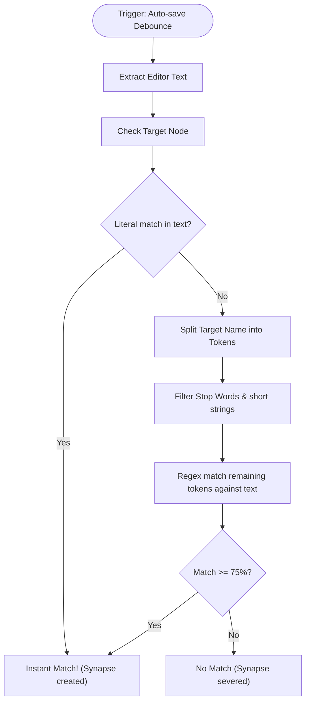

# Auto-Synapse Engine (NLP)

The Auto-Synapse engine runs entirely locally inside the browser. It tokenizes the user's keystrokes and performs semantic matching against all other node titles in the graph to automatically suggest connections.

## The Matching Algorithm



The matching logic lives at the top of `BlockEditor.jsx`. It runs every time the editor auto-saves (debounced at 1 second).

### 1. Stop Word Filtering
First, a predefined Set of common English stop words prevents false-positive matches on meaningless words.
```javascript
const STOP_WORDS = new Set(["a", "an", "the", "and", "or", "but", "to", "of", "in", "for", "on", "with", "as", "is", "it", "this", "that", "at", "by", "from"]);
```

### 2. Tokenization & Scoring
When checking if the current document's text matches a target node's name, the engine follows these rules:
1. **Literal Match**: If the target node's name appears exactly in the text, it's an instant match.
2. **Tokenization**: If no literal match is found, the target node's name is split into an array of words (tokens).
3. **Filtering**: Any token $\le 2$ characters or existing in the `STOP_WORDS` set is discarded.
4. **Regex Validation**: The engine loops through the remaining tokens, using word-boundary regex (`\btoken\b`) to see if they appear in the editor's text.

```javascript
let matchCount = 0;
for (const token of nameTokens) {
  const regex = new RegExp(`\\b${token}\\b`, 'i');
  if (regex.test(textLower)) {
    matchCount++;
  }
}

// Calculate the percentage of matched significant tokens
const matchPercentage = matchCount / nameTokens.length;
return matchPercentage >= 0.75; 
```

### Why 75%?
A 75% threshold ensures that multi-word concepts (e.g. "Information Architecture") will trigger a suggestion even if the user slightly alters the phrasing, but prevents single common words from triggering aggressive, annoying popups.

## The Stale Link Cleaner
The Auto-Synapse engine also works in reverse. During the debounce save cycle, the engine loops through all *existing* links connected to the current node.

It checks the current text to see if the semantic justification for the link still exists (either via the 75% match or a literal `[[WikiLink]]` tag). If neither is found, the link is forcefully removed from Firestore, ensuring the knowledge graph stays mathematically clean without manual pruning by the user.
