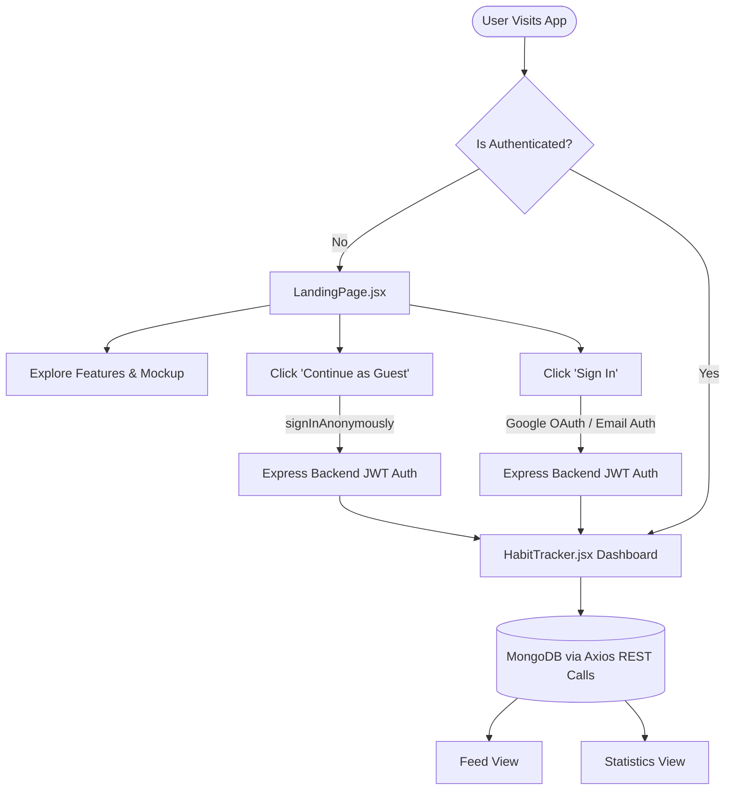
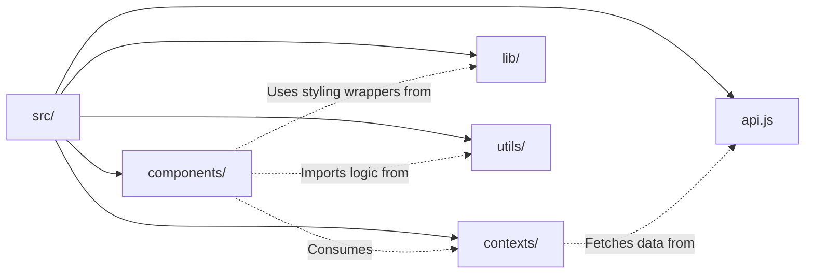
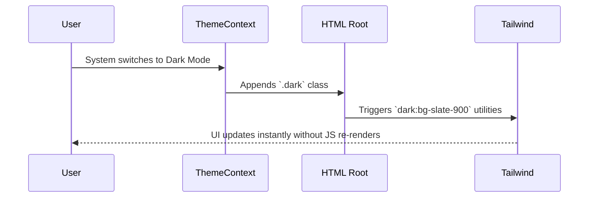

# System Architecture

**do.it** operates as a full-stack MERN application utilizing React 18, Vite, Express, and MongoDB. It strictly separates UI components from pure utility functions, relying on a deeply integrated context and REST API architecture.

## High-Level Authentication & Data Flow

The core architecture is built around **frictionless onboarding**. The application utilizes an anonymous JWT Auth system to immediately grant access, meaning the database logic never has to check for "unauthenticated" edges once the user is inside the main application flow.



## Architectural Directories

The project follows a highly modular structure, ensuring pure logic is decoupled from React renders.



### Purpose of Each Layer

| Directory | Purpose | Key Details |
| :--- | :--- | :--- |
| `components/` | React UI | Contains all visual elements (`AddHabitModal.jsx`, `Heatmap.jsx`). Fully isolated from backend data fetching. |
| `contexts/` | Global State | Manages the `ThemeContext`, `AuthContext`, and `HabitContext` to distribute API data and state. |
| `api.js` | Backend Config | Centralizes Axios instance and token interceptors for communicating with the Express API. |
| `lib/` | Styling Wrappers | Houses utility functions like `cn` (combining `clsx` and `tailwind-merge`) to compile dynamic Tailwind classes on the fly. |
| `utils/` | Business Logic | Pure JavaScript functions (e.g., streak calculations, date standardizations) that can be unit tested independent of React. |

## Network Architecture & Axios Interceptors

Because **do.it** operates on a separated frontend and backend (unlike Next.js or Firebase where it's tightly coupled), every request to the backend must be authorized. 

Instead of manually attaching the JWT token to every single `fetch` request inside the components, the architecture delegates this exclusively to the centralized `api.js` Axios instance:

```javascript
// frontend/src/api.js
import axios from 'axios';

const api = axios.create({
  baseURL: import.meta.env.VITE_API_URL || 'http://localhost:5001/api',
});

// Request interceptor automatically attaches the JWT
api.interceptors.request.use((config) => {
  const token = localStorage.getItem('token');
  if (token) {
    config.headers.Authorization = `Bearer ${token}`;
  }
  return config;
});

export default api;
```

With this pattern, the `HabitContext` can simply call `api.get('/habits')` and be guaranteed that the authentication headers are securely injected.

## The Liquid Glass Aesthetic System

Instead of relying heavily on complex Javascript for theming, the application leverages native CSS variables and Tailwind.

1. **Theme Context:** `ThemeContext.jsx` reads `window.matchMedia('(prefers-color-scheme: dark)')`.
2. **Class Injection:** It dynamically injects the `.dark` class into the root `<html>` element.
3. **Tailwind Orchestration:** The entire color scheme pivots flawlessly using Tailwind's `dark:` modifier.


