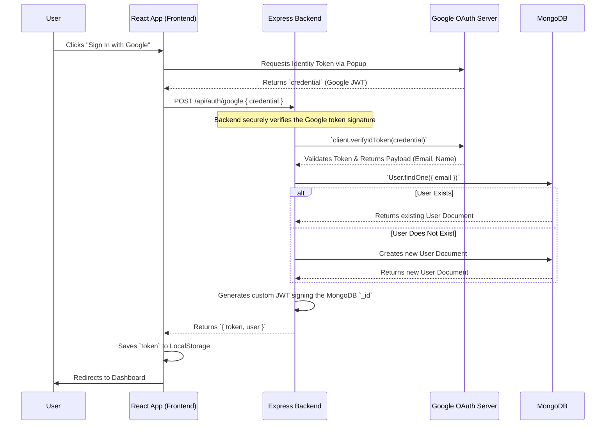

# Authentication Flow

**do.it** employs a robust, custom Identity Management system. By combining Google OAuth 2.0 with a custom JWT (JSON Web Token) implementation, the application provides frictionless "Guest" onboarding while securely handling permanent account upgrades.

## 1. Google OAuth Verification Flow

When a user clicks "Sign In with Google", the frontend does *not* receive the user's password or direct database access. Instead, it receives an encrypted Google Identity Token (`credential`) which must be securely verified by our backend.



### The Google Verification Code

The backend uses the official `google-auth-library` to ensure the token actually came from Google and is intended for our specific `CLIENT_ID`.

```javascript
// backend/routes/auth.js snippet
import { OAuth2Client } from 'google-auth-library';
const client = new OAuth2Client(process.env.GOOGLE_CLIENT_ID);

router.post('/google', async (req, res) => {
  const { credential } = req.body;
  
  // 1. Verify the Google Token
  const ticket = await client.verifyIdToken({
    idToken: credential,
    audience: process.env.GOOGLE_CLIENT_ID,
  });
  
  const payload = ticket.getPayload();
  const { email, name, sub: googleId } = payload;
  
  // 2. Find or Create the User in MongoDB
  let user = await User.findOne({ email });
  if (!user) {
    user = new User({ email, displayName: name, googleId, isAnonymous: false });
    await user.save();
  }
  
  // 3. Issue our own JWT
  const token = jwt.sign({ id: user._id }, process.env.JWT_SECRET, { expiresIn: '30d' });
  res.json({ token, user });
});
```

## 2. Anonymous Guest Sessions

To achieve "frictionless onboarding", users who click "Continue as Guest" skip the Google OAuth step entirely.

1. The frontend hits `POST /api/auth/anonymous`.
2. The backend creates a new Mongoose `User` with `isAnonymous: true` and no email/password.
3. A JWT is issued.
4. The user is instantly logged in. All habits they create are tied to their permanent MongoDB `_id`.

## 3. Account Upgrading (The `/link` Route)

If a Guest user decides they want to save their data permanently, they click "Sign In".

Because they are *already logged in* as a guest (they possess a valid JWT), the frontend calls `POST /api/auth/link` instead of the standard `/google` login route.

1. The `auth` middleware verifies their Guest JWT.
2. The backend verifies the new Google Token.
3. Instead of creating a new user, the backend **updates** their existing Guest document in MongoDB, setting `isAnonymous: false` and attaching the new Google email.
4. All of their existing habits remain perfectly intact, because their MongoDB `_id` never changed!
