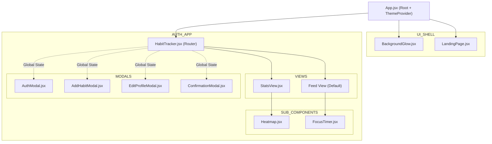

# Component Breakdown

This document provides a breakdown of the key React components in the `do.it` architecture.

## Component Hierarchy



## State Management & React Contexts

The MERN architecture replaces the old real-time Firestore listeners with React Context providers that wrap the entire application tree.

### `AuthContext.jsx`
The AuthContext manages the current user session and exposes the Axios HTTP interceptor so that the user's JWT is securely stored and managed.

```javascript
// Example AuthContext implementation
import { createContext, useState, useEffect } from 'react';
import api from '../api';

export const AuthContext = createContext();

export const AuthProvider = ({ children }) => {
  const [user, setUser] = useState(null);
  
  // Exposes a login function that calls the Express /google route
  const loginWithGoogle = async (credential) => {
    const res = await api.post('/auth/google', { credential });
    localStorage.setItem('token', res.data.token);
    setUser(res.data.user);
  };
  
  return (
    <AuthContext.Provider value={{ user, loginWithGoogle }}>
      {children}
    </AuthContext.Provider>
  );
};
```

### `HabitContext.jsx`
The HabitContext wraps `HabitTracker.jsx` and maintains the global state for the user's habits.

```javascript
// Example HabitContext implementation
import { createContext, useState, useEffect } from 'react';
import api from '../api';

export const HabitContext = createContext();

export const HabitProvider = ({ children }) => {
  const [habits, setHabits] = useState([]);
  
  // Fetches data from MongoDB via the Express API
  const fetchHabits = async () => {
    const res = await api.get('/habits');
    setHabits(res.data);
  };
  
  // Optimistically updates the UI while sending the PUT request
  const toggleHabit = async (habitId, dateStr) => {
    // 1. Update local state immediately
    // 2. Await api.put(`/habits/${habitId}`)
    // 3. Revert local state if API fails
  };
  
  return (
    <HabitContext.Provider value={{ habits, fetchHabits, toggleHabit }}>
      {children}
    </HabitContext.Provider>
  );
};
```

## Main Layout & Routing

### `App.jsx`
*   **Role:** The application root wrapper.
*   **Details:** It provides the `ThemeProvider` to the entire tree and dictates the top-level route (mounting either `HabitTracker` or `LandingPage`).

### `HabitTracker.jsx`
*   **Role:** The core dashboard and authenticated router.
*   **Details:** Handles API polling or initial data fetch via `HabitContext` to load the user's habits. Manages the global state for all modals (Add, Edit, Auth) and handles navigation between the main "Feed" and the "Statistics" view.

### `LandingPage.jsx`
*   **Role:** Marketing page for unauthenticated users.
*   **Details:** A rich, animated marketing page. Features a mocked dashboard, floating UI elements, a Bento Grid feature highlight, and a seamless CSS Marquee of user reviews.

### `BackgroundGlow.jsx`
*   **Role:** Ambient visual styling.
*   **Details:** A purely visual component that renders ambient, slowly rotating blurred orbs in the background. It reads the `ThemeContext` to dynamically change its color palette based on whether the app is in Light or Dark mode.

## Modals & Forms

### `AddHabitModal.jsx`
*   **Role:** Universal modal for creating and updating habits.
*   **Details:** A complex, animated macOS-style window. It supports keyboard shortcuts (`Enter` to submit) and aggressively saves partial user inputs as "drafts" using `localStorage`, preventing data loss if accidentally closed.

### `AuthModal.jsx`
*   **Role:** Handles all identity logic.
*   **Details:** Supports Email/Password sign-up and login, as well as Google OAuth via `@react-oauth/google`. Crucially, it gracefully handles upgrading Anonymous accounts to permanent accounts using the `/api/auth/link` REST endpoint.

### `ConfirmationModal.jsx`
*   **Role:** Destructive action prevention.
*   **Details:** A reusable, generic prompt used to confirm destructive actions (like deleting a habit).

## Data Visualization & Tools

### `StatsView.jsx`
*   **Role:** The statistical dashboard.
*   **Details:** Calculates aggregate metrics like overall completion rate and total habits. It serves as the wrapper for the `Heatmap`.

### `Heatmap.jsx`
*   **Role:** GitHub-style yearly contribution graph.
*   **Details:** Processes raw habit completion dates into a structured 7-day by 52-week grid. It calculates color intensities based on the number of habits completed on a specific day compared to the user's total active habits.

### `FocusTimer.jsx`
*   **Role:** Productivity tool.
*   **Details:** Operates in two modes: a compact "docked" mode and an immersive "fullscreen" mode. It supports multiple work intervals (e.g., Deep Work, Short Break) and tracks the number of completed Pomodoro cycles.
