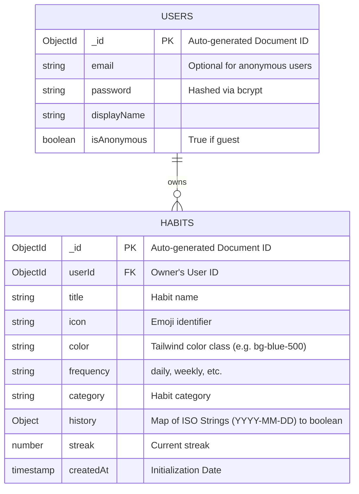

# Database Schema (MongoDB & Mongoose)

**do.it** uses a NoSQL document structure in MongoDB via Mongoose. To maximize speed and minimize query complexity, the data model is extremely flat. All habits are stored in a `habits` collection, and all users in a `users` collection.

## Entity Relationship Diagram



### Mongoose Schema Implementations

The Entity Relationship diagram is implemented in the backend using the following strictly-typed Mongoose schemas.

#### `User.js`
```javascript
import mongoose from 'mongoose';

const userSchema = new mongoose.Schema({
  email: { type: String, unique: true, sparse: true },
  password: { type: String },
  googleId: { type: String },
  displayName: { type: String },
  isAnonymous: { type: Boolean, default: false },
}, { timestamps: true });

export default mongoose.model('User', userSchema);
```
*Note: `sparse: true` on the `email` index is critical. It allows multiple anonymous users to exist without triggering a MongoDB "Duplicate Key" error on a null email.*

#### `Habit.js`
```javascript
import mongoose from 'mongoose';

const habitSchema = new mongoose.Schema({
  userId: { 
    type: mongoose.Schema.Types.ObjectId, 
    ref: 'User', 
    required: true,
    index: true // Massively speeds up the GET /api/habits query
  },
  title: { type: String, required: true },
  icon: { type: String, default: '🎯' },
  color: { type: String, default: 'bg-blue-500' },
  frequency: { type: String, default: 'daily' },
  category: { type: String, default: 'Health' },
  history: { 
    type: Map, 
    of: Boolean, 
    default: {} 
  },
  streak: { type: Number, default: 0 },
}, { timestamps: true });

export default mongoose.model('Habit', habitSchema);
```

## Security Rules & Limitations

The structure is secured by the Express backend using JWT authentication. A custom `auth` middleware intercepts requests, decodes the Bearer token, and ensures users can only read/write documents where the `userId` field matches their authenticated MongoDB `_id`.

**Handling Anonymous Users**
The backend implements an explicit guest-user flow. When a user clicks "Continue as Guest", the backend immediately creates a new `User` document with `isAnonymous: true` and generates a valid JWT. If they choose to upgrade, their document is simply updated with an email and hashed password, completely preserving their existing habit data.

## The `history` Object Structure

Instead of creating a new document in a subcollection every time a user completes a habit, the system updates a simple `history` Map/Object on the habit itself. The keys are ISO date strings (`"YYYY-MM-DD"`) and the values are booleans (`true`).

### Why this approach?
1. **Massively Reduced Reads:** When rendering the dashboard, the app only executes 1 read per habit. If completions were stored as separate documents, rendering 5 habits over a month would cost 150 reads instead of 5.
2. **Simplified Calculation:** The streak and heatmap algorithms operate entirely client-side. They simply iterate through the `history` object, and compute the math instantly without needing complex server-side aggregations.

### The Timezone Solution
When a user clicks "Complete", the system does not use a raw `new Date()` object, which contains localized hour/minute data. 

Instead, it passes the date through a `getTodayStr()` utility function that standardizes the current date to a strictly local ISO string (e.g. `"2026-08-12"`). This prevents notorious timezone bugs where a user completes a habit at 11:50 PM, but the database saves it as "tomorrow" because the server is in UTC.
