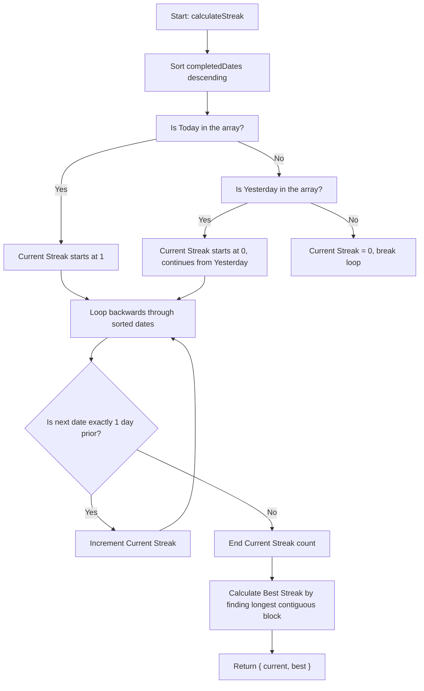
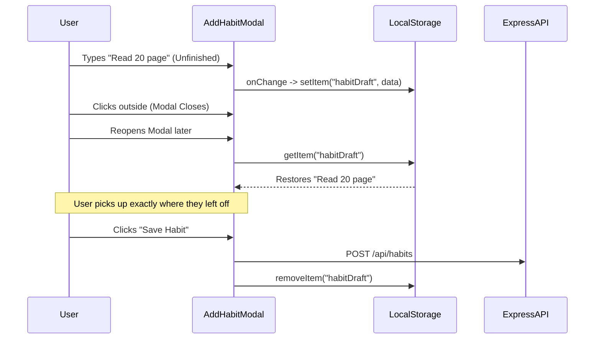

# Core Features Deep Dive

Detailed workflows explaining how **do.it** calculates streaks, persists drafts, and handles visual continuity.

## 1. Robust Streak Calculation Algorithm

The streak calculation doesn't run on the server; it runs on the client. It must be resilient enough to handle array sorting, timezone differences, and distinguishing between "current" and "best" streaks.

## 2. Draft Memory System

Modal forms automatically remember partial inputs (drafts) even if the user accidentally clicks away and closes the modal. 

## 3. The "Liquid Glass" Visual Aesthetic

The UI abandons flat colors entirely, relying on stacking translucent layers.

This aesthetic is achieved strictly through CSS variables and `@layer utilities` inside `index.css`, allowing it to be compiled seamlessly by Tailwind CSS.

*   **`.glass-card`:** The primary surface material. It uses `backdrop-filter: blur(40px) saturate(180%) brightness(1.05)` combined with subtle white borders and drop shadows to simulate thick, frosted glass.
*   **`.glass`:** A secondary, slightly lighter glass for navigation bars and inner panels.
*   **`.glass-glow`:** A hover state that injects a responsive cyan drop-shadow to simulate interactive depth when the user's cursor approaches the element.

Because these layers use `backdrop-filter`, whatever ambient color is rendered behind them (e.g. the slowly rotating orbs in `BackgroundGlow.jsx`) will naturally bleed through, tinting the UI automatically based on the user's system theme.
