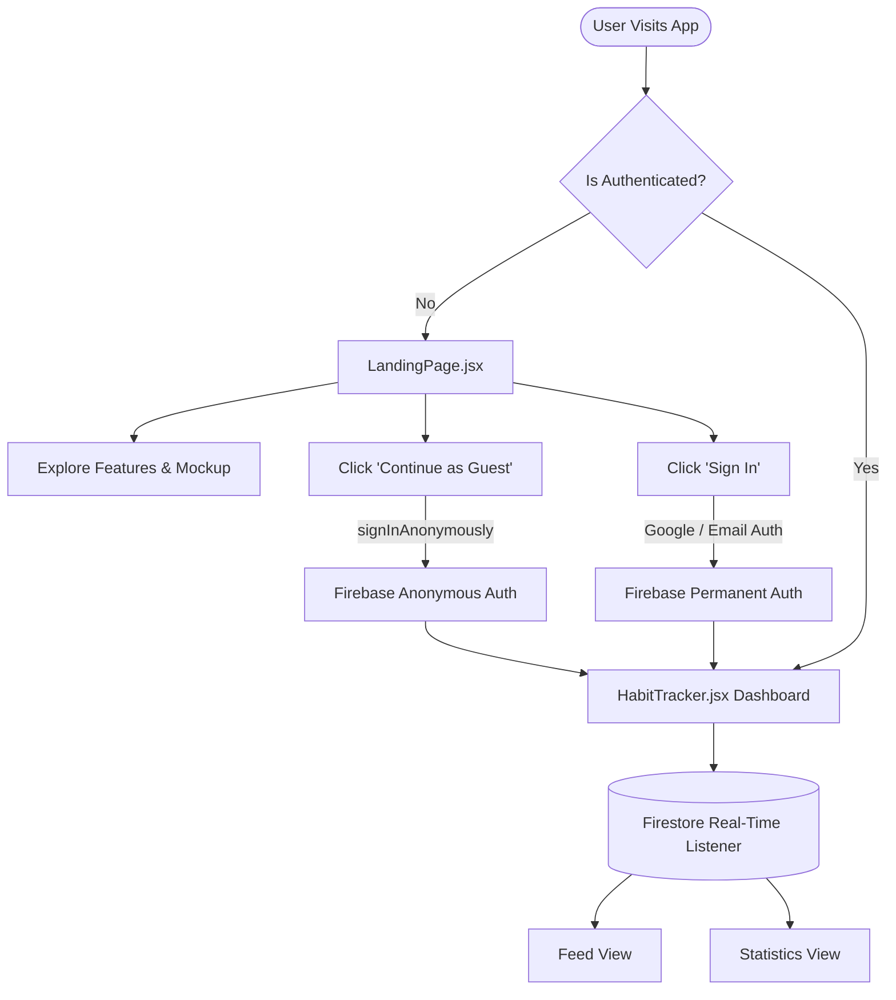
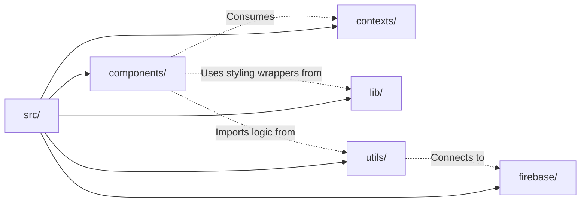
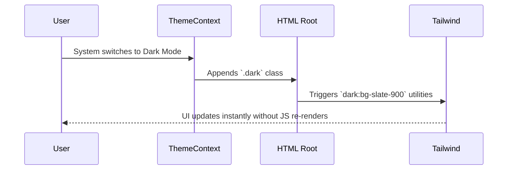

# System Architecture

**do.it** operates entirely as a client-side Single Page Application (SPA) utilizing React 18, Vite, and Firebase. It strictly separates UI components from pure utility functions, relying on a deeply integrated context and real-time database architecture.

## High-Level Authentication & Data Flow

The core architecture is built around **frictionless onboarding**. The application utilizes Firebase Anonymous Auth to immediately grant access, meaning the database logic never has to check for "unauthenticated" edges once the user is inside the main application flow.

## Architectural Directories

The project follows a highly modular structure, ensuring pure logic is decoupled from React renders.

### Purpose of Each Layer

| Directory | Purpose | Key Details |
| :--- | :--- | :--- |
| `components/` | React UI | Contains all visual elements (`AddHabitModal.jsx`, `Heatmap.jsx`). Fully isolated from Firebase initialization logic. |
| `contexts/` | Global State | Currently manages the `ThemeContext`, intelligently reading system preferences and persisting overrides. |
| `firebase/` | Backend Config | Centralizes Firebase App, Auth, and Firestore initialization. |
| `lib/` | Styling Wrappers | Houses utility functions like `cn` (combining `clsx` and `tailwind-merge`) to compile dynamic Tailwind classes on the fly. |
| `utils/` | Business Logic | Pure JavaScript functions (e.g., streak calculations, date standardizations) that can be unit tested independent of React. |

## The Liquid Glass Aesthetic System

Instead of relying heavily on complex Javascript for theming, the application leverages native CSS variables and Tailwind.

1. **Theme Context:** `ThemeContext.jsx` reads `window.matchMedia('(prefers-color-scheme: dark)')`.
2. **Class Injection:** It dynamically injects the `.dark` class into the root `<html>` element.
3. **Tailwind Orchestration:** The entire color scheme pivots flawlessly using Tailwind's `dark:` modifier.

