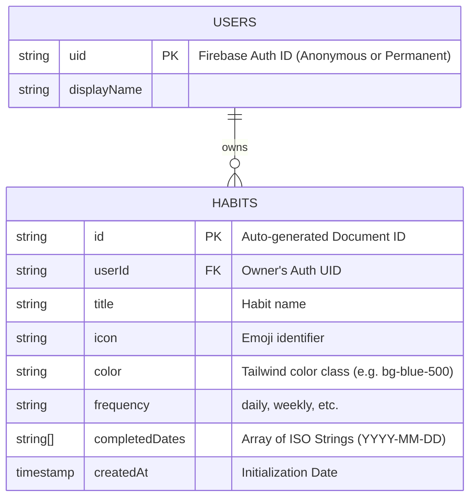

# Database Schema (Firestore)

**do.it** uses a NoSQL document structure in Cloud Firestore. To maximize speed and minimize query complexity, the data model is extremely flat. All habits are stored in a single top-level `habits` collection.

## Entity Relationship Diagram

## Security Rules & Limitations

The structure is heavily secured by Firebase Security Rules ensuring users can only read/write documents where the `userId` field matches their authenticated UID. 

**Wait, where are the "users" stored?**
The beauty of the `do.it` database schema is that it largely ignores a `users` collection. Because the app heavily leans on Firebase Anonymous Auth, storing a separate user document for every single person who casually visits the landing page would bloat the database rapidly.

Instead, the identity layer is handled entirely by Firebase Auth. The `HABITS` collection binds directly to the Firebase Auth UID.

## The `completedDates` Array Structure

Instead of creating a new document in a subcollection every time a user completes a habit, the system pushes an ISO date string (`"YYYY-MM-DD"`) into the `completedDates` array field on the habit itself.

### Why this approach?
1. **Massively Reduced Reads:** When rendering the dashboard, the app only executes 1 read per habit. If completions were stored as separate documents, rendering 5 habits over a month would cost 150 reads instead of 5.
2. **Simplified Calculation:** The streak and heatmap algorithms operate entirely client-side. They simply take the `completedDates` array, sort it, and compute the math instantly without needing complex server-side aggregations.

### The Timezone Solution
When a user clicks "Complete", the system does not use a raw `new Date()` object, which contains localized hour/minute data. 

Instead, it passes the date through a `getTodayStr()` utility function that standardizes the current date to a strictly local ISO string (e.g. `"2026-08-12"`). This prevents notorious timezone bugs where a user completes a habit at 11:50 PM, but the database saves it as "tomorrow" because the server is in UTC.
