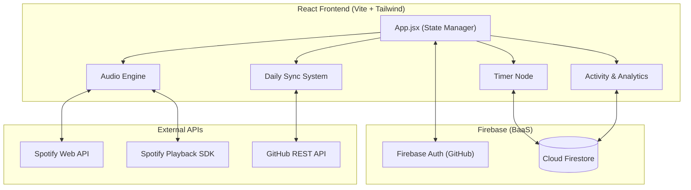
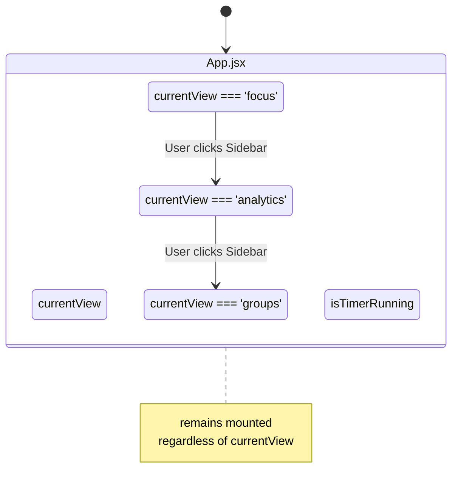

# System Architecture

**VERTO.** operates entirely as a client-side application (Single Page Application) with no custom backend server. All persistent data, authentication, and external integrations are handled directly from the browser using third-party services.

## High-Level Topology

## Technology Stack Breakdown

| Technology | Purpose | Key Details |
| :--- | :--- | :--- |
| **React 19** | UI Library | Heavy use of hooks (`useState`, `useEffect`, `useMemo`, `useCallback`) and Portals (`createPortal`) for the floating timer widget. |
| **Vite 8** | Build Tool | Provides fast HMR and optimized production builds. |
| **Tailwind CSS v4** | Styling | Utility-first styling. The project relies entirely on inline utility classes and arbitrary values (`bg-[#030712]`) rather than a customized `tailwind.config.js` theme. |
| **Firebase Auth** | Identity | Configured exclusively with the GitHub provider. Requests the `repo` scope during sign-in to obtain an access token capable of pushing commits. |
| **Cloud Firestore** | Database | Uses real-time listeners (`onSnapshot`) for the Activity Log and Groups, and one-shot queries (`getDocs`) for Analytics and Global Leaderboards. |
| **Recharts 3.9** | Data Visualization | Renders the 7-day volume bar chart and category distribution donut chart. |

## Core Architectural Patterns

### 1. State-Based View Management
The application does not use URL-based routing (e.g., React Router). Instead, the master `App.jsx` component maintains a `currentView` state string (`'focus'`, `'activity'`, `'groups'`, `'analytics'`, `'audio'`). 

*   **Persistent Timer:** When navigating away from the `'focus'` view, the `<Timer />` component is not unmounted. It is hidden via CSS or transitioned into a floating background widget. This prevents the timer state from resetting during navigation.

### 2. Hybrid Audio Architecture
The app uses a dual-pathway approach to control Spotify without a backend:
*   **Audio Engine (SDK):** It loads the Spotify Web Playback SDK script to register the browser as a valid playback device ("Verto Audio Engine").
*   **Transport Controls (REST):** To avoid common cross-origin iframe messaging bugs inherent to the SDK, all transport actions (Play, Pause, Skip, Seek, Volume) bypass the SDK methods and are instead sent as direct REST API requests to `api.spotify.com/v1/me/player`.

### 3. Client-Side Aggregation
Because there is no backend to run periodic aggregations, intensive calculations happen on the client:
*   **Global Leaderboard:** Fetches *every* document in the `sessions` collection, groups them by `uid`, sums the XP, and sorts them entirely in the browser memory.
*   **Group Diagnostics:** Fetches sessions for all members of a specific group and computes category breakdowns on the fly.
