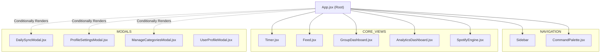
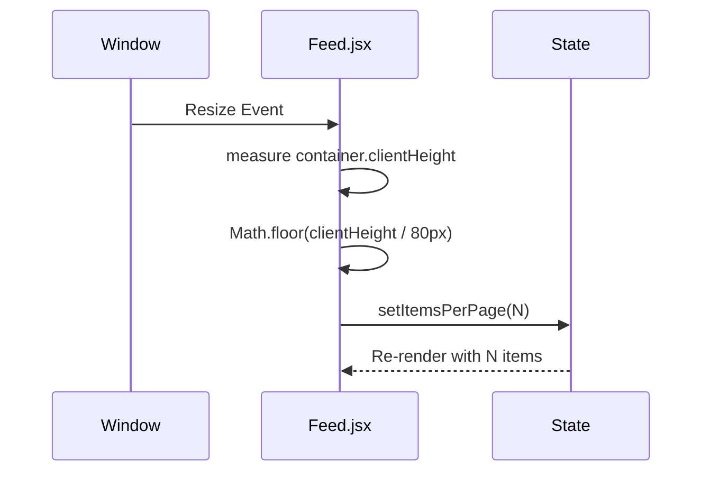

# React Component Reference

This document provides a breakdown of the key React components in the `src/components/` directory, illustrating how VERTO's shallow but wide component tree prioritizes monolithic feature blocks managed by a central state controller.

## Component Hierarchy



## Core Layout & Navigation

### `App.jsx`
*   **Role:** The master layout, view router, and state manager.
*   **Key State:** 
    *   `user`: Firebase Auth object.
    *   `currentView`: Drives the main panel rendering (`'focus'`, `'activity'`, etc.).
    *   Modal visibility toggles.
*   **Details:** Keeps the `<Timer />` component mounted but hidden via CSS when switching views to prevent timer reset. Handles global keyboard shortcuts (Ctrl+K).

### `CommandPalette.jsx`
*   **Role:** The global quick-launcher (Cmd/Ctrl + K).
*   **Details:** Supports command mode (fuzzy search through navigation actions) and User Search Mode (typing `@` queries the Firestore `users` collection for public profiles).

## Main Views

### `Timer.jsx` and The React Portal System

The `Timer.jsx` component uses an advanced React pattern. When the user navigates away from the `'focus'` view while a timer is active, `App.jsx` passes `isBackground={true}` to `Timer.jsx`.

Instead of rendering normally within the `App` flexbox layout, `Timer.jsx` returns a `createPortal`:

```jsx
// Simplified logic in Timer.jsx
if (isBackground) {
    return ReactDOM.createPortal(
        <div className="draggable-floating-widget">
            {time}
        </div>,
        document.body
    );
}
```

This ejects the timer from the DOM hierarchy, placing it directly inside `<body>`, ensuring it floats above all other UI elements without z-index conflicts or flexbox constraints.

### `Feed.jsx` and Dynamic Pagination

Instead of hardcoding "10 items per page", the component uses a `ResizeObserver` on the list container to calculate `itemsPerPage` dynamically.



This ensures the UI looks perfectly flush on any monitor size, from a small laptop to a 4K display, without unnecessary white space or scrollbars.

### `GroupDashboard.jsx`
*   **Role:** Management interface for Teams/Guilds.
*   **Details:** Handles joining via 6-character codes. Renders a per-group leaderboard and a "Network Diagnostics" panel that visualizes the category breakdown of each group member's focused time.

### `AnalyticsDashboard.jsx`
*   **Role:** Data visualization hub.
*   **Details:** Uses `Recharts` for bar and pie charts. Implements a custom 12-week (84-day) heatmap grid where cell color intensity scales with the number of sessions logged that day.

## Modals & Dialogs

### `DailySyncModal.jsx`
*   **Role:** Interface for committing to GitHub.
*   **Details:** Aggregates today's unsynced sessions, generates markdown, interfaces with the GitHub Contents API to read/update the log file, and updates Firestore sync flags via a `writeBatch`.

### `ProfileSettingsModal.jsx`
*   **Role:** User settings, data export, and account deletion.
*   **Details:** The Danger Zone tab uses a 500-document `writeBatch` loop to wipe user data from Firestore before deleting the Firebase Auth identity. Handles `auth/requires-recent-login` errors by prompting re-authentication.
