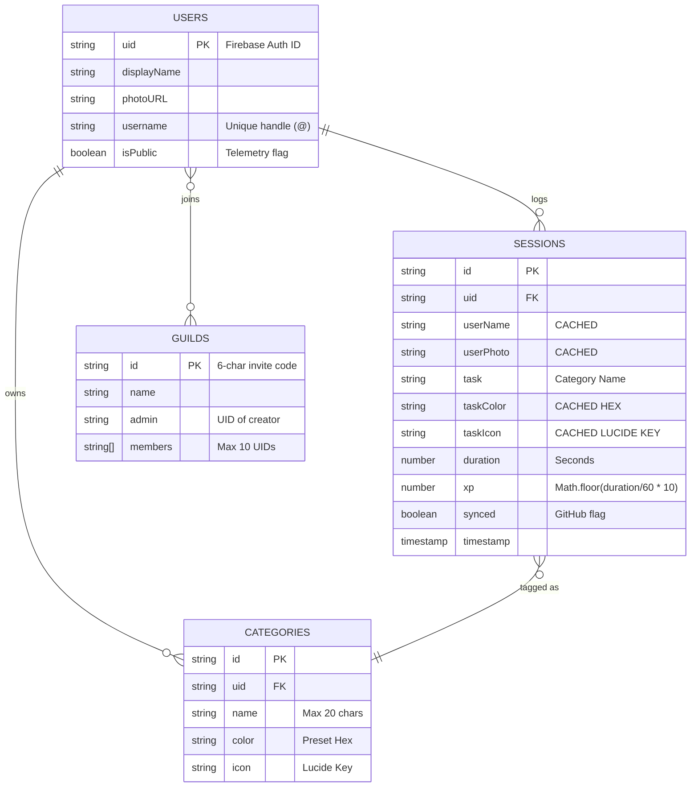

# Database Schema (Firestore)

VERTO relies on Cloud Firestore. To avoid complex server-side joins and minimize database read costs, the data model aggressively uses **denormalization** (caching related data).

## Entity Relationship Diagram

## Deep Dive: Denormalization Strategy

Look closely at the `SESSIONS` table in the diagram. Instead of just storing a reference to the `uid` and `categoryId`, it copies the `userName`, `userPhoto`, `taskColor`, and `taskIcon` at the exact moment the session is saved.

**Why?**
When rendering the Global Leaderboard, the app fetches thousands of sessions. If it had to perform a lookup to the `users` and `categories` tables for every single session to get the avatar and color, it would exhaust Firebase read quotas instantly. By caching the display data on the session itself, the UI renders entirely from one single `getDocs()` call. If a user deletes a category later, their historical sessions retain the correct color and icon.

## Collection Details

### 1. `users`
Created or updated when a user interacts with the Profile Settings modal. It dictates global visibility and identity overrides. The `isPublic` boolean controls whether the user appears on the Global Leaderboard and in the Command Palette user search.

### 2. `sessions`
The core data model. Every time a user completes and saves a focus timer session, a document is created here. `duration` is stored in raw seconds, and `xp` is calculated at write time.

### 3. `categories`
User-defined focus tags. A user must have at least one category to start a timer. The `icon` string maps to an `ICON_MAP` (e.g., `"Code"`, `"Terminal"`) used globally across the app.

### 4. `guilds` (Groups)
Small accountability pods that users can create or join. The Document ID is a randomly generated 6-character alphanumeric invite code (e.g., `X7B9P2`).

> **The 10-Member Guild Limit**
> Firestore limits the `in` query operator to 10 array items. Because the Group Dashboard queries the sessions collection using `where("uid", "in", activeGroup.members)`, the application imposes a hard UI restriction preventing more than 10 members per guild.
