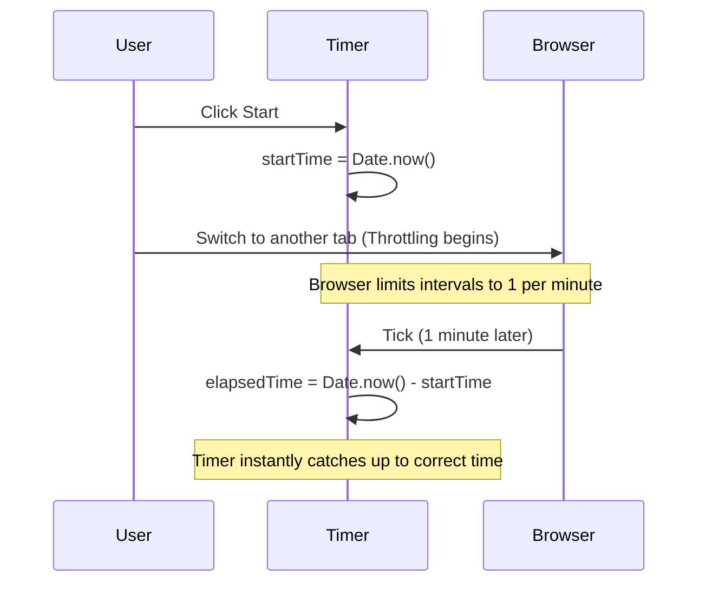
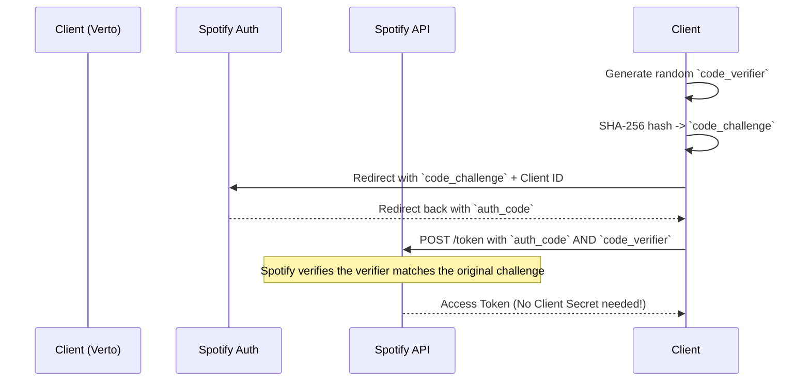

# Core Features Deep Dive

This document outlines the technical implementation details of VERTO's core features, combining visual workflow diagrams with deep-dive technical explanations.

## 1. The Neural Timer Engine (Anti-Throttling)

Modern browsers aggressively throttle JavaScript `setInterval` execution in inactive tabs (often dropping them to 1 tick per minute). If the timer relied on counting seconds via intervals, it would lose massive amounts of time when backgrounded.

**Solution:** When the user clicks "Start", the app captures a `startTime = Date.now()` anchor. Every tick recalculates the total elapsed time by comparing the current `Date.now()` against the anchor, ensuring absolute precision regardless of tab throttling.



## 2. In-App Audio Engine & Client-Side PKCE

The Audio Engine provides seamless music control without leaving the focus environment. Since VERTO has no backend, it cannot securely store a Spotify `CLIENT_SECRET`. Instead, it uses the OAuth 2.0 PKCE (Proof Key for Code Exchange) flow natively in the browser (`src/spotify.js`).



## 3. GitHub Daily Sync Workflow

The Daily Sync feature transforms Firebase sessions into Markdown and commits them directly to a GitHub repository using the GitHub REST API.

1.  **OAuth Scope:** During initial login, the Firebase GitHub provider requests the `repo` scope. The resulting OAuth access token is saved in `localStorage`.
2.  **Aggregation:** Queries Firestore for all sessions logged between `startOfToday` and `endOfToday`.

```mermaid
flowchart TD
    A[Start Sync] --> B[Query Firestore]
    B --> C{Sessions exist where synced==false?}
    C -- No --> D[Show "Already Synced" message]
    C -- Yes --> E[Generate Markdown Table]
    
    E --> F[GET repo contents /logs/YYYY-MM-DD.md]
    F --> G{File exists?}
    
    G -- Yes (Capture SHA) --> H[Append new Markdown to existing content]
    G -- No --> I[Use new Markdown content]
    
    H --> J[Base64 Encode Content]
    I --> J
    
    J --> K[PUT to GitHub API with content and SHA]
    K --> L[Update Firestore docs to synced=true]
    L --> M[Sync Complete]
```

## 4. XP and Leveling Systems

VERTO equates time focused directly to XP. The formula is `Math.floor((durationInSeconds / 60) * 10)` (i.e., 10 XP per full minute).

Interestingly, the codebase contains **three distinct ranking systems**:
1.  **Global Leaderboard (Active):** Displays raw, accumulated XP.
2.  **Focus Tiers (Active):** Displayed on Profile Cards (`UserProfileModal.jsx`). Maps total XP to titles: *Initiate (<100) -> Novice (<500) -> Adept (<1500) -> Elite (<4000) -> Master*.
3.  **Player Badges (Unused):** Located in `PlayerStats.jsx`. A fully built, animated widget that maps XP to hacker-themed badges (*GHOST -> RUNNER -> HACKER -> ADMIN -> PRIME*). It includes a particle-animated level-up modal but is not currently imported into the main app tree.
